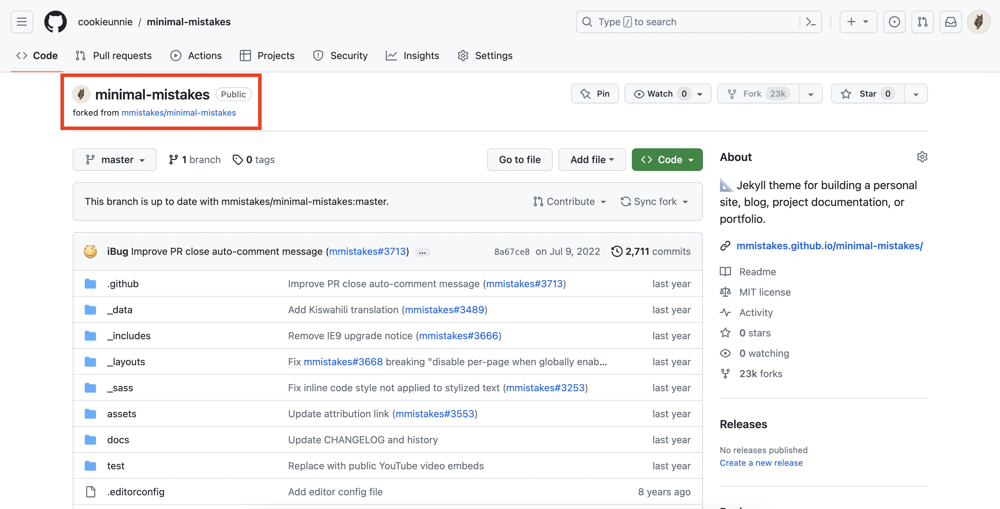
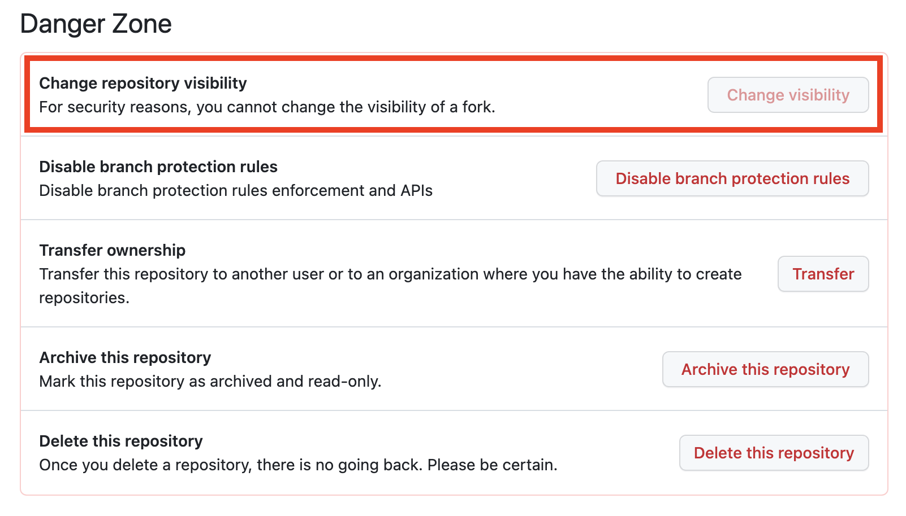
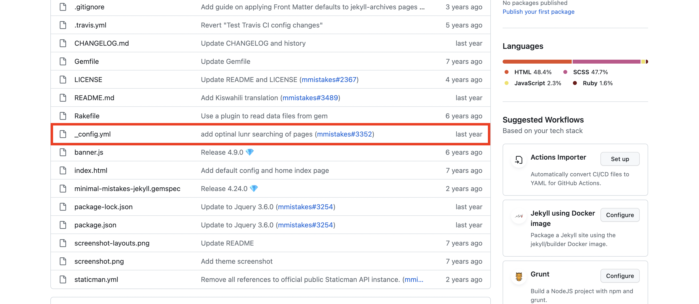
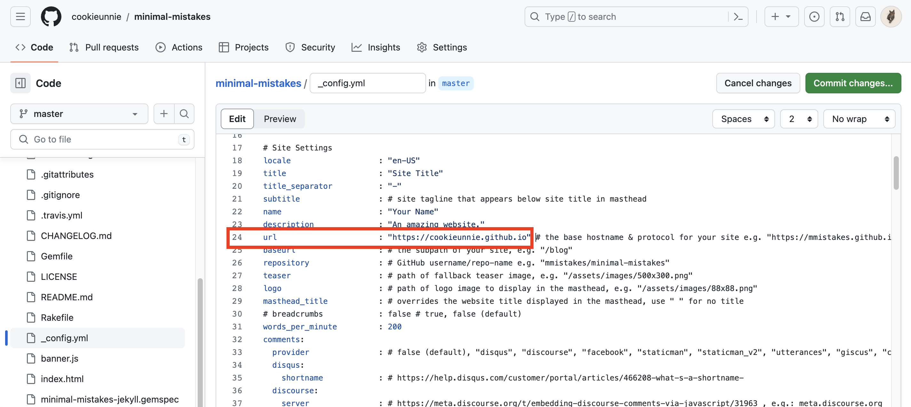
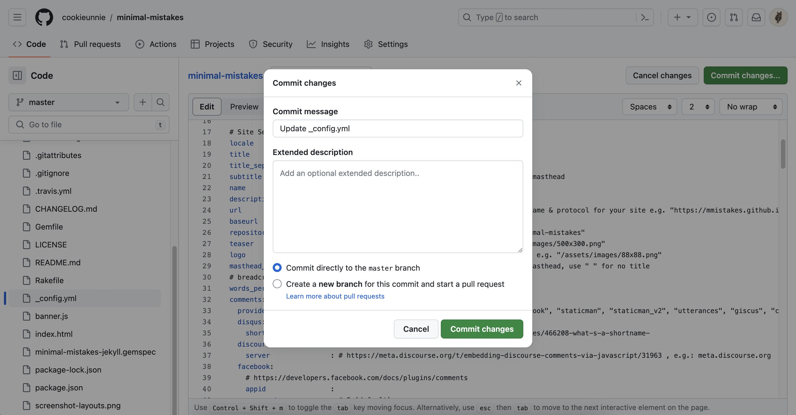
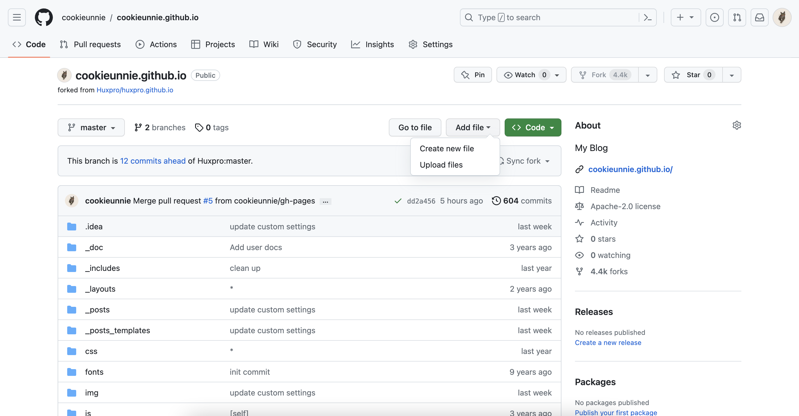
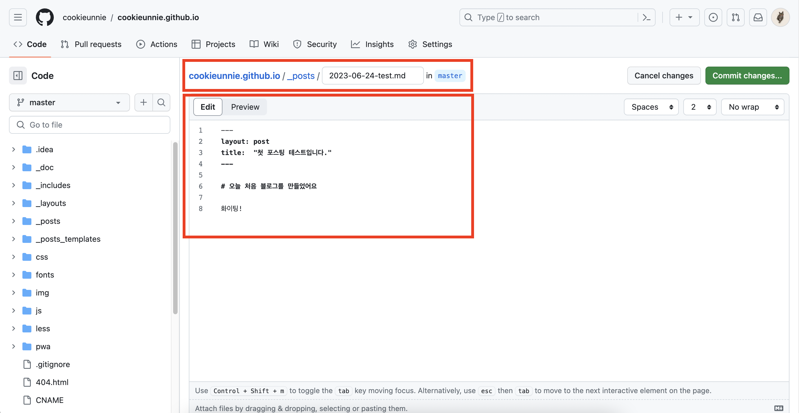

---
layout: post
title:  "[Github 블로그] 블로그 시작하기"
---

# [Github 블로그] 블로그 시작하기 

첫 포스팅 주제를 무엇으로 할까 고민하다가, 

깃허브로 블로그를 시작하는 방법을 정리해보기로 했다. 

알아보다보니 Ruby, Jekyll 설치부터 차근히 하는 방법들도 있는 것 같은데 

템플릿으로 우선 내가 설정한 github.io에서 템플릿이라도 호스팅되는 걸 보고 시작하는게 

흥미로운 첫 시작으로는 좋은 것 같다. 

## 1. 템플릿 고르기

마음에 드는 템플릿을 아래 링크에서 하나 골라준다. 

https://github.com/topics/jekyll-theme

## 2. 내 Github로 템플릿 Fork해오기 

마음에 드는 템플릿을 Fork해오려면 내 github계정이 있어야한다. 

선택한 템플릿을 클릭하면 아래 이미지처럼 해당 Repository에서 Fork할 수 있다.  

Fork할때 원하는 Repository 명으로 바꿔줘도 되고 일단 만들고 나중에 수정해줘도 된다. 

Fork하면 내 Repository에서 아래 이미지처럼 만들어진 것을 확인할 수 있다. 

레포지토리를 Private으로 바꾸고 싶었지만 Fork한 레포는 Public만 가능하다고 한다. 

( ++ Private Repository를 만들어서 Fork한 Public Repository의 작업물을 가져오는 방식으로 진행하는 방법을 시도해보았는데

호스팅하려는 Repository는 Public이여야한다고 한다... 이걸 모르고 삽질을 꽤 오래 했지만 Github 계정을 Pro로 업데이트 

하는게 아니라면 아직까지는 별다른 방법이 없어보인다 ㅠㅠ )

## 3. 원하는 URL로 템플릿 띄우기 

내가 원하는 주소로 템플릿을 호스팅하기 위해서 _config.yml 파일을 수정해야한다. 

해당 파일을 클릭하면 github에서 바로 수정이 가능하다.

내가 원하는 URL주소로 변경하고, Commit한다. 

첫번째 방법으로 바로 master 브랜치에 커밋하면 실제로 호스팅될때까지는 1~2분 정도 소요되는 것 같다. 

## 4. 블로그 기본 설정값 커스텀하기

3번까지 진행하고나면 내가 지정한 URL에서 템플릿이 호스팅되는 것을 확인할 수 있다. 

템플릿의 설정값들을 하나씩 커스텀해가면서 나의 블로그로 변경해가면 되는데,

템플릿들마다 기본 설정값들이 다르기때문에 README.md 파일을 참고해서 수정하면 된다. 

하지만, 보통 README.md에 있는 온갖 실행 명령어를 읽다보면 흥미가 떨어질 수 있으므로 (?)

일단 3번에서 수정했던 _config.yml 파일만 먼저 수정해보는 것을 추천한다. 

그 이유는 템플릿 예시 값들과 주석에 나와있는 설명으로 충분히 내가 원하는 대로 커스텀하기가 편하고

일단 포스팅을 하기 전에 표지나, 블로그 설명 등 기본적으로 바꿔야할 것들을 우선 커스텀할 수 있기 때문이다. 

장담컨대 여기까지만해도 첫 커스텀에 신중을 기하다보면 은근히 시간이 꽤 걸린다 

## 5. 포스팅하기

4번에서 블로그가 내가 원하는 대로 어느 정도 예쁘게 틀이 완성되었다면, 

내 첫 포스팅을 시도해보자. 

(++ 4번까지는 예시를 위해 현재 블로그와 다른 템플릿을 Fork하여 보여주었으므로, 5번부터는 예시화면이 조금 다를 수 있음)

포스팅은 간략하게 그냥 _post 폴더에 마크다운 파일을 추가한다고 생각하면 된다. 

_post 폴더가 없다면 생성해주고 마크다운 파일을 해당 폴더에 추가해주면 된다. 

 아래 이미지와 같이 Add file > Create new file을 선택해주면, 파일을 생성할 수 있다.

_posts 폴더가 없다면 입력란에 `_posts/` 를 입력해주면 된다. 

그럼 아래 이미지처럼 바로 경로가 입력되고 뒤에 파일명을 생성할 수 있게끔 변경된다.

이름은 `날짜-파일명.md`로 생성해보자.

아래 링크에서 지킬 포스팅 Docs를 참고해보자. 

https://jekyllrb-ko.github.io/docs/posts/

포스팅은 아래와 같이 아래 위 `---` 로 감싸져있는 Header로 시작되어야하며, layout과 title 등을 입력하면 된다. 

_config.yml 파일을 수정할 때와 같이 커밋하고 master 브랜치에 반영하면 포스팅 된 것을 확인할 수 있다. 

